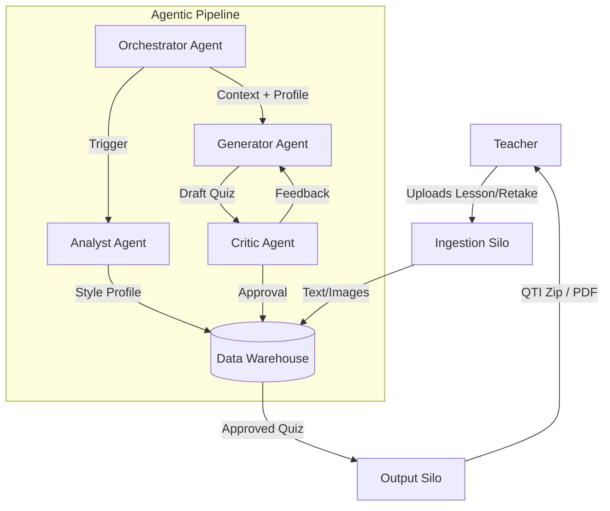

# System Architecture: Quiz Generation Platform

**Version:** 1.0  
**Status:** Planning  
**Architect:** Robyn Collie (Agentic AI Engineer Portfolio)

---

## 1. Executive Summary

This document outlines the architecture for the "Quiz Retake Generator," transforming it from a monolithic script into a scalable, **Agentic AI Pipeline**. The architecture is designed to demonstrate enterprise-grade data engineering patterns ("Silos", "Pipelines", "Warehousing") integrated with state-of-the-art Agentic workflows (Orchestration, Reflection, Critique).

The system follows a **Lesson-to-Assessment** data flow, where unstructured teacher content is ingested, structured, analyzed, and synthesized into professional-standard assessments through a rigorous, multi-agent feedback loop.

---

## 2. High-Level Architecture

The system is composed of four primary layers:

1.  **Ingestion Layer (ETL):** Extracts and normalizes data from disparate file formats.
2.  **Data Warehouse Layer:** Persists state, content context, and generated artifacts.
3.  **Agentic Core (The "Brain"):** A multi-agent system managing the logic of generation and critique.
4.  **Presentation/Output Layer:** Formats final deliverables for the user (Canvas/PDF).

---

## 3. Component Detail: The "Silo" Approach

To ensure modularity and testability (mirroring the PIQ System), functionality is divided into discrete **Silos**.

### 3.1 Ingestion Silo (ETL Pipeline)
*   **Responsibility:** "Extract and Load".
*   **Inputs:** PDF, DOCX, Images.
*   **Process:**
    *   **Text Extraction:** OCR (if needed) or text parsing from documents.
    *   **Image Extraction:** Extracting embedded images and saving to the `extracted_images` store.
    *   **Chunking:** Splitting long texts into semantic chunks for better RAG retrieval.
*   **Output:** Structured records in the `Lesson_Context` and `Retake_Examples` tables.

### 3.2 Data Warehouse (State Management)
*   **Technology:** SQLite (Local Development) -> Snowflake/Postgres (Production Path).
*   **Schema:**
    *   `Lessons`: Metadata about the taught material.
    *   `Assets`: Paths to extracted images/diagrams.
    *   `Quizzes`: Generated quiz metadata (versioning, status).
    *   `Questions`: Individual question items (allows mix-and-match).
    *   `Feedback_Logs`: Audit trail of teacher/critic feedback.

### 3.3 Agentic Core (The Logic)
This is the heart of the "Agentic AI" portfolio demonstration.

*   **Orchestrator (The Manager):**
    *   Manages the state of the job.
    *   Routes tasks between agents.
    *   Handles the "Human-in-the-loop" pause for teacher feedback.

*   **Analyst Agent (The Profiler):**
    *   **Task:** Reads the `Retake` PDF.
    *   **Output:** A "Style Profile" (e.g., "70% MC, 20% TF, 10% Images, rigorous 7th-grade vocabulary").
    *   **Goal:** Ensures the new quiz feels like the old one.

*   **Generator Agent (The Writer):**
    *   **Task:** Synthesizes questions based on `Lesson_Context` and `Style Profile`.
    *   **Capabilities:** Can request RAG searches if context is missing.

*   **Critic Agent (The Reviewer):**
    *   **Task:** Validates output against `qa_guidelines.txt`.
    *   **Behavior:** Acts as a strict gatekeeper. If guidelines are violated (e.g., "Fill-in-the-blank detected"), it rejects the draft and sends it back to the Generator with specific error messages.

### 3.4 Output Silo
*   **Responsibility:** "Transform and Present".
*   **Inputs:** Approved JSON structure from the Warehouse.
*   **Process:**
    *   **PDF Generation:** Uses ReportLab to create human-readable previews.
    *   **QTI Packaging:** XML serialization for Canvas LMS compatibility.
    *   **Zip Bundling:** Packaging manifests and assets.

---

## 4. Technology Stack

*   **Language:** Python 3.10+
*   **Orchestration:** LangGraph (preferred for cyclic agent flows) or LangChain.
*   **LLM Provider:** Google Gemini (Current) / OpenAI (Alternative).
*   **Database:** SQLite / SQLAlchemy.
*   **Document Processing:** PyMuPDF (Fitz), python-docx.
*   **Output Generation:** ReportLab (PDF), ElementTree (XML).

## 5. Future Scalability
*   **API Interface:** The Orchestrator can be wrapped in FastAPI to serve a React frontend.
*   **Vector Search:** `Lesson_Context` can be embedded into a Vector Store (ChromaDB) to support massive textbooks.
