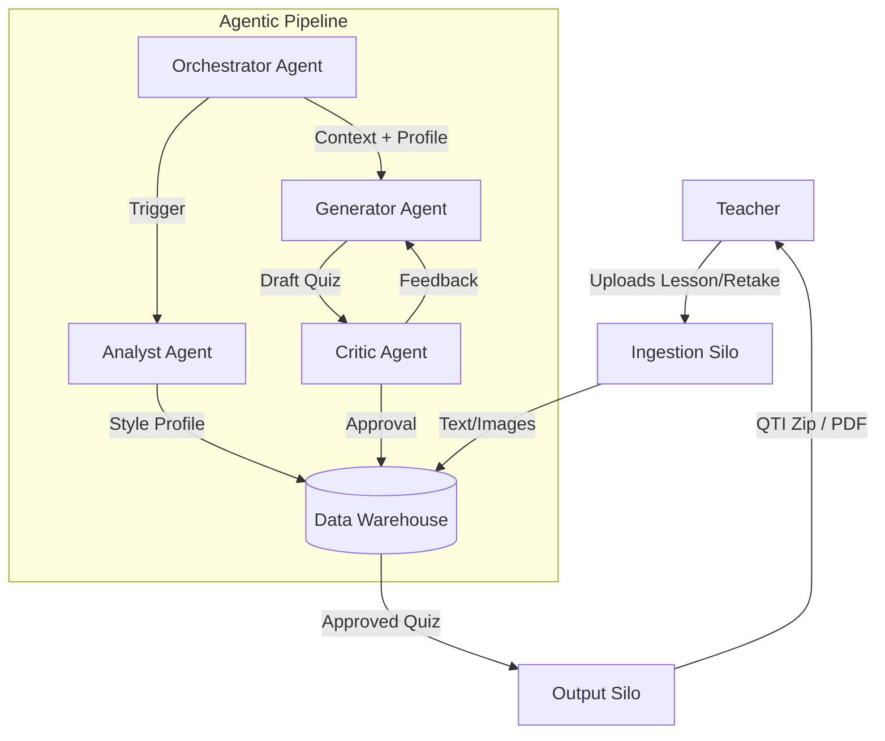
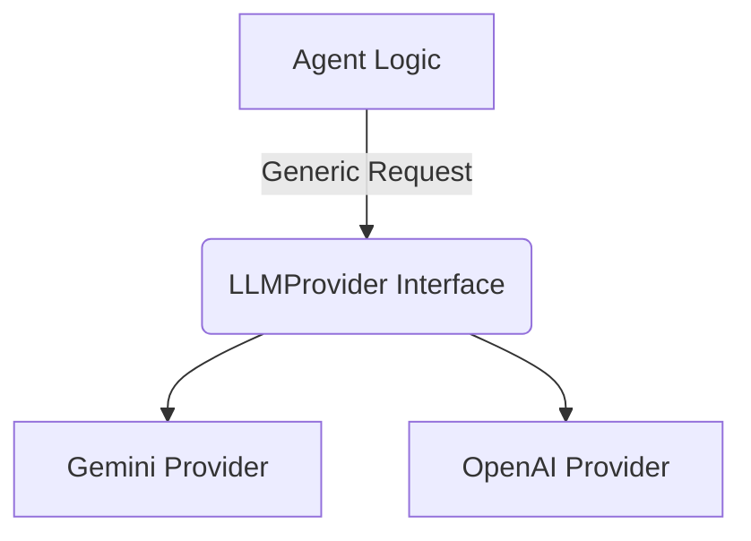

# System Architecture: Quiz Generation Platform

**Version:** 1.2
**Status:** Planning

---

## 1. Executive Summary

This document outlines the architecture for the "Quiz Retake Generator," transforming it from a monolithic script into a scalable, **Agentic AI Pipeline**. The architecture is designed to demonstrate enterprise-grade data engineering patterns ("Silos", "Pipelines", "Warehousing") integrated with state-of-the-art Agentic workflows (Orchestration, Reflection, Critique).

The system follows a **Lesson-to-Assessment** data flow, where unstructured teacher content is ingested, structured, analyzed, and synthesized into professional-standard assessments through a rigorous, multi-agent feedback loop.

---

## 2. High-Level Architecture

The system is composed of four primary layers:

1.  **Ingestion Layer (ETL):** Extracts and normalizes data from disparate file formats.
2.  **Data Warehouse Layer:** Persists state, content context, and generated artifacts.
3.  **Agentic Core (The "Brain"):** A multi-agent system managing the logic of generation and critique.
4.  **Presentation/Output Layer:** Formats final deliverables for the user (Canvas/PDF).

---

## 3. Component Detail: The "Silo" Approach

To ensure modularity and testability (mirroring the PIQ System), functionality is divided into discrete **Silos**.

### 3.1 Ingestion Silo (ETL Pipeline)
*   **Responsibility:** "Extract and Load".
*   **Inputs:** PDF, DOCX, Images.
*   **Process:**
    *   **Standard Ingestion:** Simple text and image extraction from DOCX, TXT, and basic PDFs.
    *   **Advanced Multimodal Ingestion:** For complex PDFs, leverages a powerful multimodal model (e.g., Gemini 3 Pro) to perform layout analysis (see section 6).
*   **Output:** Structured records in the `Lesson_Context` and `Retake_Examples` tables.

### 3.2 Data Warehouse (State Management)
*   **Technology:** SQLite (Local Development) -> Snowflake/Postgres (Production Path).
*   **Schema:** `Lessons`, `Assets`, `Quizzes`, `Questions`, `Feedback_Logs`.

### 3.3 Agentic Core (The Logic)
*   **Orchestrator (The Manager):** Manages the state of the job and delegates tasks.
*   **Analyst Agent (The Profiler):** Analyzes the `Retake` PDF to create a "Style Profile".
*   **Generator Agent (The Writer):** Synthesizes questions based on lesson content and the style profile.
*   **Critic Agent (The Reviewer):** Validates output against the formal `Evaluation_Rubric.md`.

### 3.4 Output Silo
*   **Responsibility:** "Transform and Present".
*   **Process:** Generates PDF previews and Canvas-compatible QTI packages.

---

## 4. Technology Stack

*   **Language:** Python 3.10+
*   **Orchestration:** LangGraph (preferred) or LangChain.
*   **LLM Provider:** Pluggable via Abstraction Layer (see below).
*   **Database:** SQLite / SQLAlchemy.
*   **Document Processing:** PyMuPDF (Fitz), python-docx.

---

## 5. LLM Provider Abstraction

The system uses an **LLM Provider Abstraction Layer** to remain model-agnostic. This allows for easy configuration to use different models (e.g., Gemini, GPT, Claude) by implementing a common interface.

---

## 6. Advanced Multimodal Ingestion

To achieve a deeper understanding of the source material, the ingestion silo will leverage a powerful multimodal model (like Gemini 3 Pro). Instead of performing a simple text extraction, this process will treat each document page as an image, allowing the model to analyze the layout and semantic content.

**Workflow:**
1.  Each PDF page is rendered as a high-resolution image.
2.  The image is sent to a multimodal LLM provider.
3.  The provider is prompted to return a structured JSON object representing the page's content, including headings, paragraphs, and descriptions of diagrams and their captions.
4.  This structured data is stored in the database, preserving the rich context of the original document.

This approach is a key differentiator, enabling the agentic system to reason about the relationship between text and visuals in the source material.

---

## 7. Future Extensibility & MCP Integration

The architecture is designed to be extensible. Future enhancements can be added with minimal disruption.

*   **API Interface:** The Orchestrator can be wrapped in a FastAPI interface.
*   **Vector Search:** For large content sources, context can be moved into a vector database.
*   **MCP (Multi-Capability Provider) Integration:** The system can leverage external tools via MCPs. Potential use cases include:
    *   **State Curriculum MCP:** To automatically fetch and validate SOL standards.
    *   **Plagiarism & Uniqueness MCP:** To ensure generated questions are novel.
