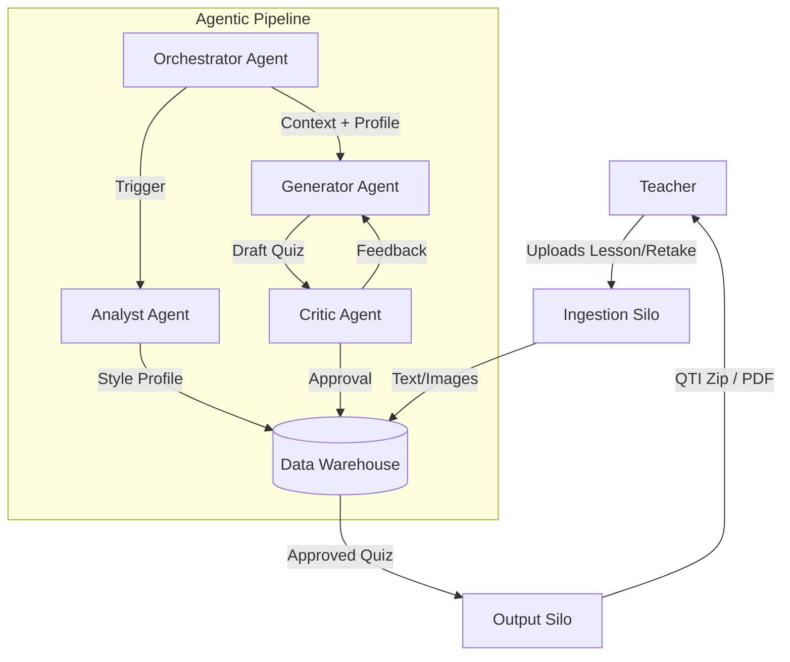

# Quiz Generator: An Agentic AI Pipeline

This project is a portfolio piece demonstrating the principles of **Agentic AI** and **Enterprise-Grade Data Engineering**. It transforms a simple task—generating a quiz retake—into a robust, multi-agent pipeline that mimics the architecture of a production AI system.

The goal is to provide a tool for teachers that automates the creation of high-quality, curriculum-aligned assessments through an iterative, AI-driven feedback loop.

---

## 1. Project Vision & Architecture

The system is designed as a scalable **Agentic AI Pipeline**, moving beyond a simple script to a structured, modular architecture. This approach is detailed in our planning documents, which showcase professional system design and project management.

*   **[System Architecture](./Project_Planning/01_System_Architecture.md):** Defines the "silo-based" architecture (Ingestion, Warehousing, Agentic Core, Output) that separates concerns and ensures scalability.
*   **[Implementation Roadmap](./Project_planning/02_Implementation_Roadmap.md):** Outlines the phased development plan, from refactoring the POC to implementing the full agentic workflow.
*   **[Agent Specifications](./Project_Planning/03_Agent_Specifications.md):** Details the prompts, roles, and tools for each AI agent in the system.

### High-Level Flow


---

## 2. Current Status & Usage

The project is currently in **Phase 2** of its development. The core architecture is in place, and the application now supports a stateful, database-driven workflow.

### CLI Workflow

1.  **Ingest Content:**
    ```bash
    python main.py ingest
    ```
    This command reads all documents from the `Content_Summary` directory, processes them, and saves their content to the local `quiz_warehouse.db` database. It intelligently skips any files that have already been ingested.

2.  **Generate a Quiz:**
    ```bash
    python main.py generate
    ```
    This command creates a new quiz run in the database, uses the ingested content to generate questions via the configured AI model, and saves the results. It produces a PDF preview and a Canvas-compatible QTI zip file in the `Quiz_Output` directory.

### CLI Options for `generate`
*   `--count <number>`: Specify the number of questions to generate.
*   `--grade "<grade>"`: Set the target grade level (e.g., `"8th Grade History"`).
*   `--sol <id1> <id2>`: List the specific SOL standards to cover.

---

## 3. Project Roadmap & Best Practices

This project is being developed following a professional, phased roadmap. We have also codified our engineering standards, including our use of pre-commit hooks, automated testing, and future extensibility patterns.

*   **[Implementation Roadmap](./Project_Planning/02_Implementation_Roadmap.md)**
*   **[Development Practices](./Project_Planning/05_Development_Practices.md)**
*   **[Pedagogical Evaluation Rubric](./Project_Planning/04_Evaluation_Rubric.md)**

This project is actively under development. Follow the commit history to see the progression from a simple script to a full-fledged agentic application.

---

## 4. License

This project is licensed under the MIT License. See the [LICENSE](LICENSE) file for details.
