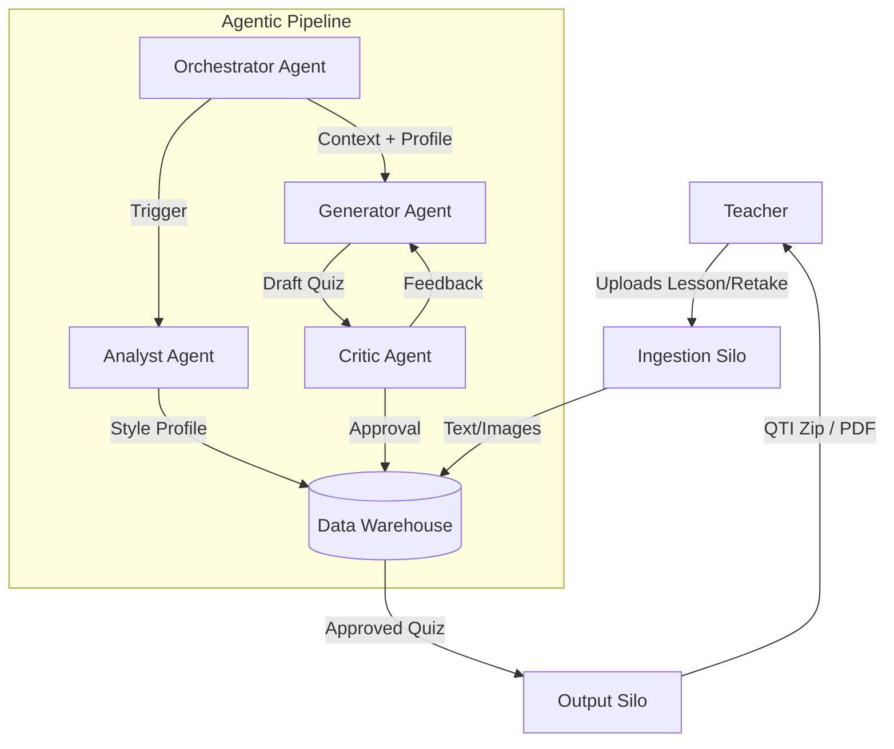

# Quiz Retake Generator: An Agentic AI Pipeline

This project is a portfolio piece demonstrating the principles of **Agentic AI** and **Enterprise-Grade Data Engineering**. It transforms a simple task—generating a quiz retake—into a robust, multi-agent pipeline that mimics the architecture of a production AI system.

The goal is to provide a tool for teachers that automates the creation of high-quality, curriculum-aligned assessments through an iterative, AI-driven feedback loop.

---

## 1. Project Vision & Architecture

The system is designed as a scalable **Agentic AI Pipeline**, moving beyond a simple script to a structured, modular architecture. This approach is detailed in our planning documents, which showcase professional system design and project management.

*   **[System Architecture](./Project_Planning/01_System_Architecture.md):** Defines the "silo-based" architecture (Ingestion, Warehousing, Agentic Core, Output) that separates concerns and ensures scalability.
*   **[Implementation Roadmap](./Project_Planning/02_Implementation_Roadmap.md):** Outlines the phased development plan, from refactoring the POC to implementing the full agentic workflow.
*   **[Agent Specifications](./Project_Planning/03_Agent_Specifications.md):** Details the prompts, roles, and tools for each AI agent in the system.

### High-Level Flow


---

## 2. Current Status (Proof of Concept)

The project currently exists as a functional proof-of-concept in `main.py`. This script demonstrates the core logic of the generation process.

### POC Setup

1.  **Dependencies:** Install the required Python packages:
    ```bash
    pip install -r requirements.txt
    ```
2.  **API Key:** Ensure you have a Google Gemini API key. Create a `.env` file in the root directory and add:
    ```
    GEMINI_API_KEY=your_api_key_here
    ```

### POC Usage

1.  **Input Content:**
    *   Place your content summary documents in the `Content_Summary` directory. Supported formats: `.pdf`, `.docx`, `.txt`.
    *   Images from these documents will be automatically extracted and used as context.
2.  **Retake Test Source:**
    *   Place the original test (as a PDF) in the `Retake` directory. The script reads this to exclude questions and match the original test's style.
3.  **Run the Script:**
    ```bash
    # Generate a quiz with the same number of questions as the retake PDF
    python main.py

    # Specify question count manually
    python main.py --count 20
    ```
4.  **Output:**
    *   The generated files are saved in the `Quiz_Output` directory.
    *   **QTI Zip:** For direct import into Canvas LMS.
    *   **PDF Preview:** A human-readable version to review questions and answers.

---

## 3. Project Roadmap

The project is evolving according to the [Implementation Roadmap](./Project_Planning/02_Implementation_Roadmap.md). The next phase is **Phase 1: Foundational Refactoring & Modularization**, where the POC script will be deconstructed into a professional, testable codebase.

This project is actively under development. Follow the commit history to see the progression from a simple script to a full-fledged agentic application.
